# 系统分析与设计（4）

## 用例建模

**阅读 Asg_RH 文档，绘制用例图。 按 Task1 要求，请使用工具 UMLet，截图格式务必是 png 并控制尺寸。**

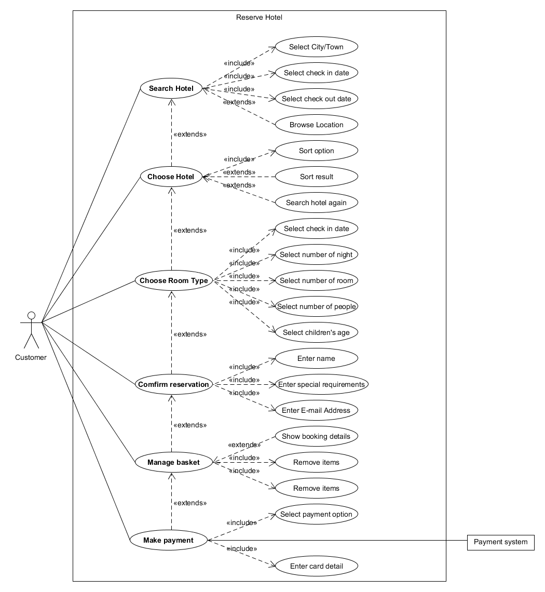

------

**选择你熟悉的定旅馆在线服务系统（或移动 APP），如绘制用例图。并满足以下要求：**

- **对比 Asg_RH 用例图，请用色彩标注出创新用例或子用例**
- **尽可能识别外部系统，并用色彩标注新的外部系统和服务**

下面以飞猪为例。

**酒店搜索**

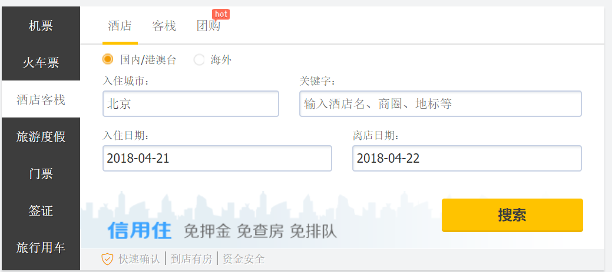

**搜索结果**

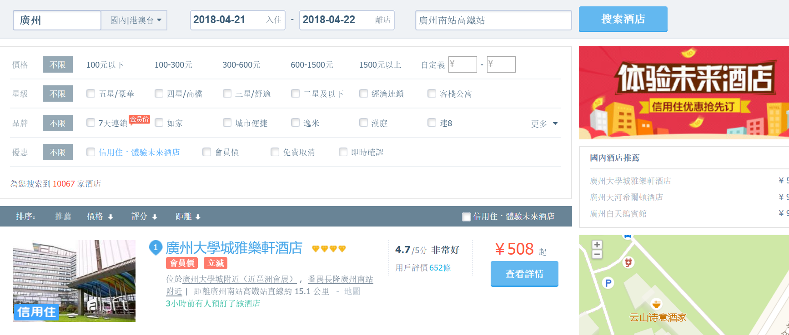

**搜索失败**

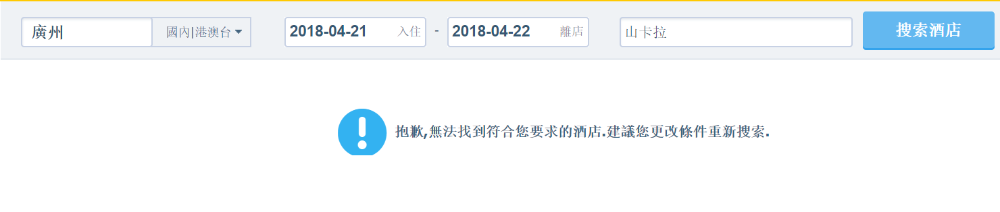

**选定酒店**

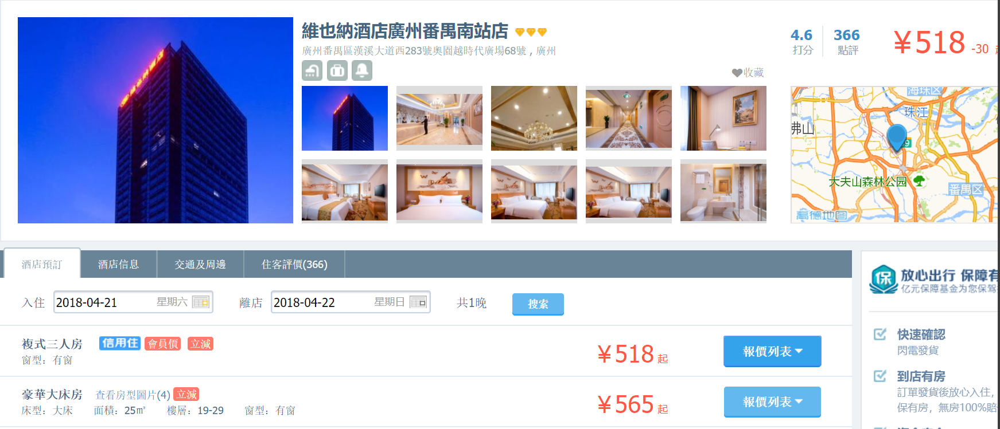

**选定酒店**

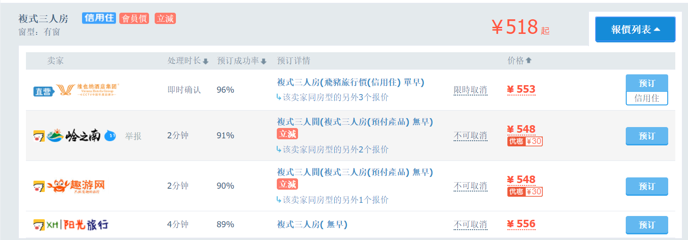

**订票登陆**

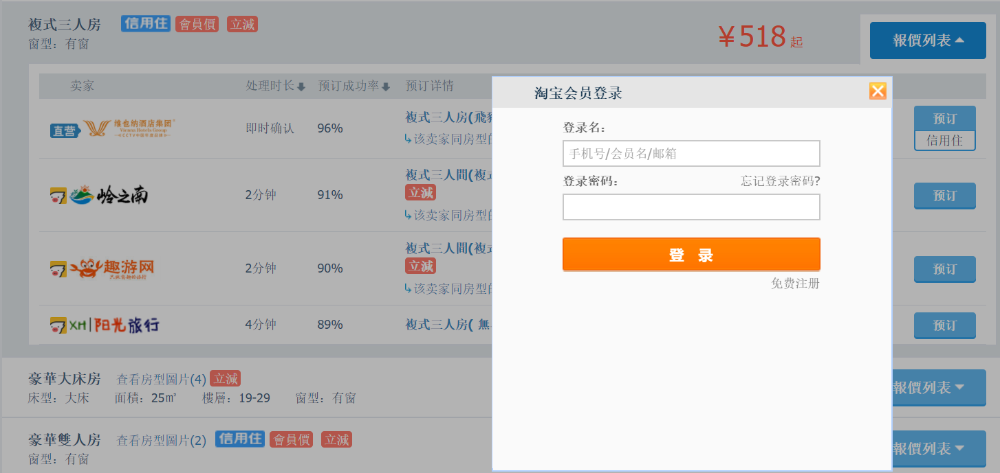

**确认订单信息**

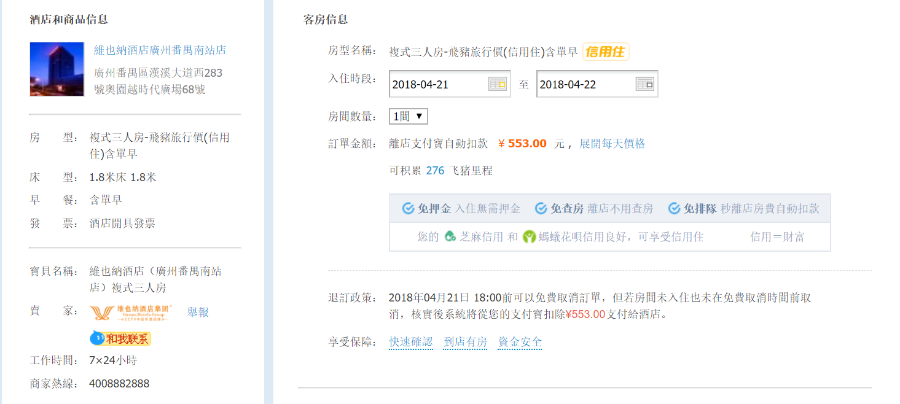

****

**入住信息**

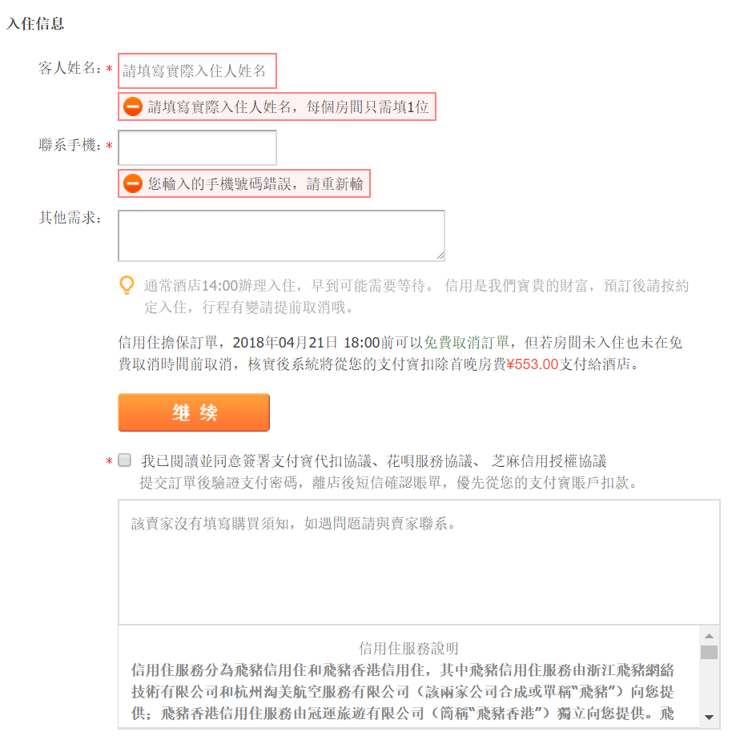

**付款**

Alipay

**用例模型**

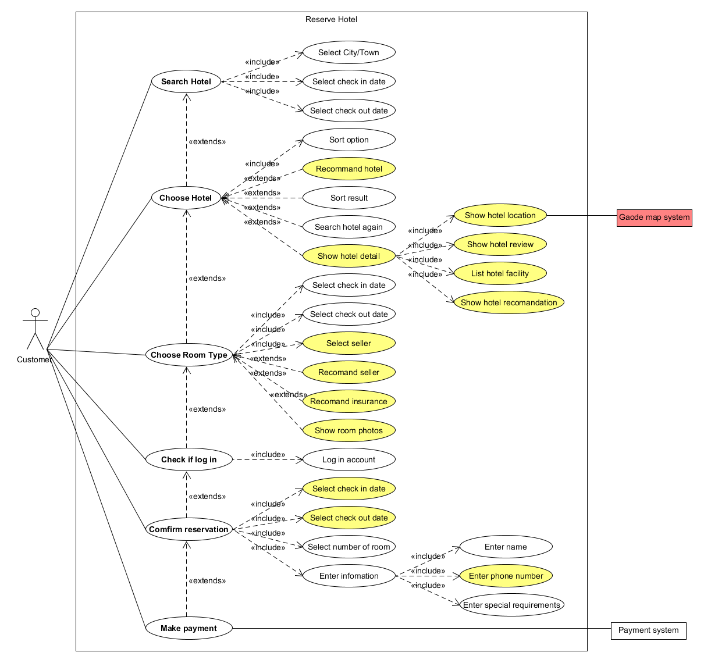

------

**对比两个时代、不同地区产品的用例图，总结在项目早期，发现创新的思路与方法**

首先找出各个时代的同类产品，重点在找与该产品同一时期的产品，并画出它们核心业务的UML图，分别对比分析自己的产品与同时代其他产品的差异，以及不同时代产品的差异，从中找出不合理的、可以改进的、系统缺少的、可能增加竞争力的地方，并且结合当代的其他产品，判断能否成为接口接入产品，简化产品生产的复杂性。与团队成员共同探讨、修改，从而确定重要的用例，采用迭代与进化式的开发，在迭代中逐渐明确需求，得出创新点。

------

**请使用 SCRUM 方法，在（任务b）用例图基础上，编制某定旅馆开发的需求 （backlog）**

|  ID  |  Title   | Est  | Iter | Imp  |                         How to demo                          |                      Notes                       |
| :--: | :------: | :--: | :--: | :--: | :----------------------------------------------------------: | :----------------------------------------------: |
|  1   | 搜索酒店 |  10  |  1   | 100  |                 选择日期、选择城市、搜索酒店                 |                注意搜索失败的反馈                |
|  2   | 预定酒店 |  20  |  1   | 150  | 在酒店列表点击选择酒店，进入详情页，查看酒店信息，选择日期、房型后，点击预订 |                                                  |
|  3   | 确认订单 |  8   |  1   |  80  |     修改时间和房间数量，查看明细，填写入住信息，点击继续     |         修改时间和房间数量，查看明细可选         |
|  4   |   付款   |  10  |  1   |  60  |               选择付款方式，输入密钥，进行付款               | 注意成功和不成功场景的反馈，以及付款的安全性问题 |
|  5   | 推荐酒店 |  10  |  2   |  80  |                     随机给几个酒店的例子                     |                                                  |

------

## 业务建模

**在（任务b）基础上，用活动图建模找酒店用例。简述利用流程图发现子用例的方法。**

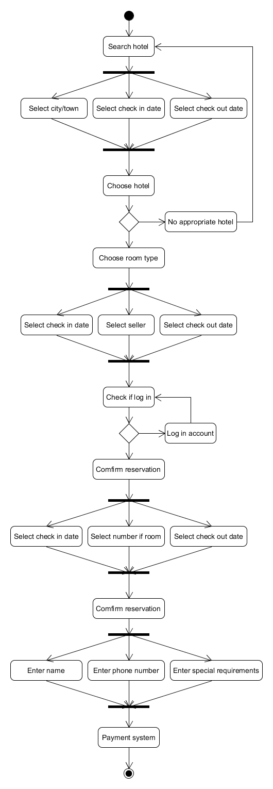

沿着流程图的起始状态开始，在每次遇到流程图的分支时都记录下来，例如遇到搜索时会有搜索成功和搜索失败两条路径。记录下当前选择的路径，直到走到终止状态，就是一个子用例。然后返回到刚刚记录的节点，选择另外一条路径，又能够生成一个子用例。如此操作直到没有记录的节点，则寻找到所有的子用例了。

------

**选择你身边的银行 ATM，用活动图描绘取款业务流程**

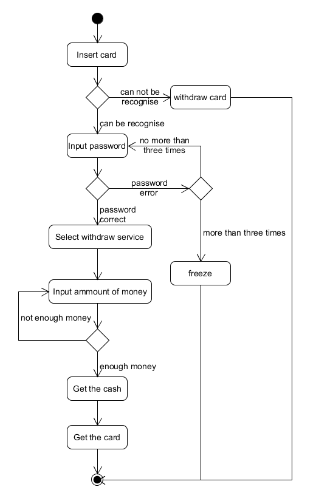

------

**查找淘宝退货业务官方文档，使用多泳道图，表达客户、淘宝网、淘宝商家服务系统、商家等用户和系统协同完成退货业务的过程。分析客户要完成退货业务，在淘宝网上需要实现哪些系统用例**

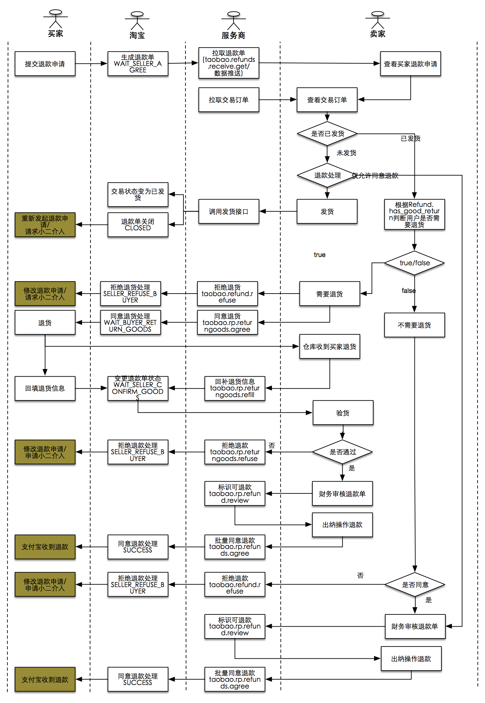

生成退款单、变更退款单状态、同意/不同意退款处理。

------

## 用例文本编写

**在大作业基础上，分析三种用例文本的优点和缺点**

1. 摘要：一段简洁的概要，通常用在主场景。在点餐系统的构思阶段，为了在便于在小组会议上讨论主题和范围，进行早期需求的分析，会用到摘要式的用例文本。它的优点是能快速编写、简洁明了，缺点就是不够细致，只用作对问题粗略的认识。
2. 非正式：即多个非正式的段落格式，用几个段落覆盖不同场景，同样用于早期的需求分析过程，优点是编写简便，比起摘要式用例文本要详细一些，有利于进一步认识问题，缺点是不够正式，需要在后续阶段精化。
3. 详述：详细地编写用例所有步骤和各种变化，同时具有补充部分，如前置条件和成功保证。详述式用例文本通常用在以摘要形式编写了很多用例以后，详细地编写其中少量具有重要意义和价值的用例中，它的优点是细节充足，正式且深入，且具有结构性，缺点是编写耗时长，比较繁琐。