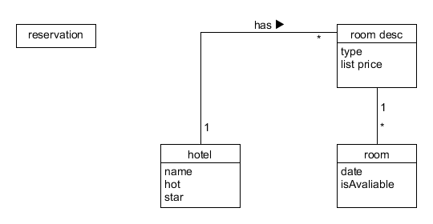
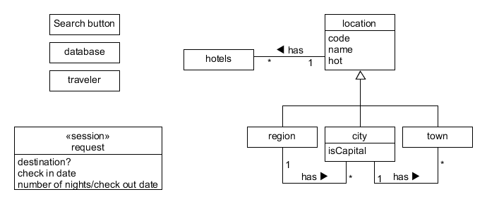
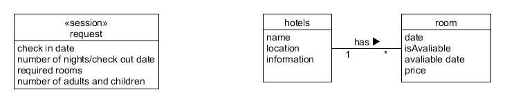
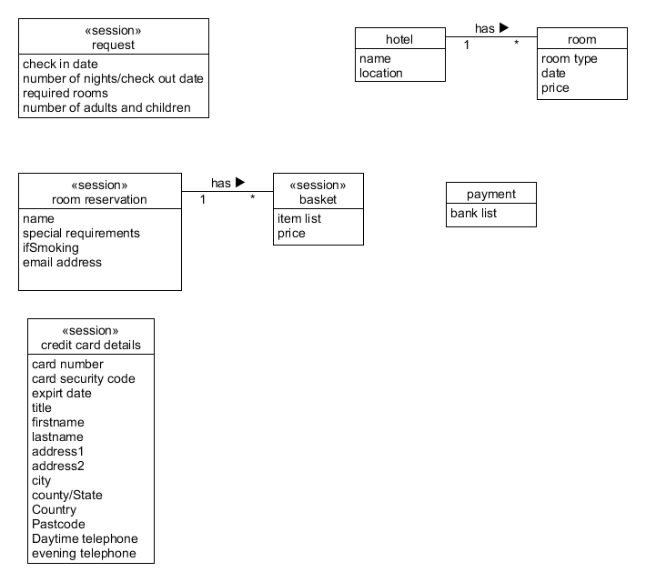

a. 阅读 Asg_RH 文档，按用例构建领域模型。
- 按 Task2 要求，请使用工具 UMLet，截图格式务必是 png 并控制尺寸
- 说明：请不要受 PCMEF 层次结构影响。你需要识别实体（E）和 中介实体（M，也称状态实体）
  - 在单页面应用（如 vue）中，E 一般与数据库构建有关， M 一般与 [store 模式](https://cn.vuejs.org/v2/guide/state-management.html) 有关
  - 在 java web 应用中，E 一般与数据库构建有关， M 一般与 session 有关
  - 
  - 
  - 
  - 

- b. 数据库建模(E-R 模型)
  - 按 Task 3 要求，给出系统的 E-R 模型（数据逻辑模型）

    

  - 导出 Mysql 物理数据库的脚本
    ```mysql
    if exists(select 1 from sys.sysforeignkey where role='FK_CUSTOMER_REFERENCE_ROOM') then
        alter table Customer
           delete foreign key FK_CUSTOMER_REFERENCE_ROOM
    end if;

    if exists(select 1 from sys.sysforeignkey where role='FK_MARKET B_REFERENCE_CUSTOMER') then
        alter table "Market Busket"
           delete foreign key "FK_MARKET B_REFERENCE_CUSTOMER"
    end if;

    if exists(select 1 from sys.sysforeignkey where role='FK_ROOM_REFERENCE_HOTEL') then
        alter table Room
           delete foreign key FK_ROOM_REFERENCE_HOTEL
    end if;

    if exists(
       select 1 from sys.systable 
       where table_name='Customer'
         and table_type in ('BASE', 'GBL TEMP')
    ) then
        drop table Customer
    end if;

    if exists(
       select 1 from sys.systable 
       where table_name='Hotel'
         and table_type in ('BASE', 'GBL TEMP')
    ) then
        drop table Hotel
    end if;

    if exists(
       select 1 from sys.systable 
       where table_name='Item'
         and table_type in ('BASE', 'GBL TEMP')
    ) then
        drop table Item
    end if;

    if exists(
       select 1 from sys.systable 
       where table_name='Market Busket'
         and table_type in ('BASE', 'GBL TEMP')
    ) then
        drop table "Market Busket"
    end if;

    if exists(
       select 1 from sys.systable 
       where table_name='Room'
         and table_type in ('BASE', 'GBL TEMP')
    ) then
        drop table Room
    end if;

    /*==============================================================*/
    /* Table: Customer                                              */
    /*==============================================================*/
    create table Customer 
    (
       CustomerID           int                            not null,
       Name                 text                           not null,
       "E-mail"             text,
       "Special Requirement" text,
       Age                  int,
       "Check In Date"      date                           not null,
       "Check Out Date"     date                           not null,
       RoomID               int,
       constraint PK_CUSTOMER primary key clustered (CustomerID)
    );

    /*==============================================================*/
    /* Table: Hotel                                                 */
    /*==============================================================*/
    create table Hotel 
    (
       HotelID              int                            not null,
       Name                 text                           not null,
       Location             text                           not null,
       constraint PK_HOTEL primary key clustered (HotelID)
    );

    /*==============================================================*/
    /* Table: Item                                                  */
    /*==============================================================*/
    create table Item 
    (
       ItemID               int                            not null,
       Name                 varchar(50)                    not null,
       Price                money                          not null,
       constraint PK_ITEM primary key clustered (ItemID)
    );

    /*==============================================================*/
    /* Table: "Market Busket"                                       */
    /*==============================================================*/
    create table "Market Busket" 
    (
       BusketID             int                            not null,
       ItemID               int(20),
       CustomerID           int,
       constraint "PK_MARKET BUSKET" primary key clustered (BusketID)
    );

    /*==============================================================*/
    /* Table: Room                                                  */
    /*==============================================================*/
    create table Room 
    (
       HotelID              int                            not null,
       RoomID               int                            not null,
       Available            bit                            not null,
       Type                 text                           not null,
       "Avaliable Number"   int                            not null,
       Price                money                          not null,
       constraint PK_ROOM primary key clustered (RoomID)
    );

    alter table Customer
       add constraint FK_CUSTOMER_REFERENCE_ROOM foreign key (RoomID)
          references Room (RoomID)
          on update restrict
          on delete restrict;

    alter table "Market Busket"
       add constraint "FK_MARKET B_REFERENCE_CUSTOMER" foreign key (CustomerID)
          references Customer (CustomerID)
          on update restrict
          on delete restrict;

    alter table Room
       add constraint FK_ROOM_REFERENCE_HOTEL foreign key (HotelID)
          references Hotel (HotelID)
          on update restrict
          on delete restrict;
    ```
  
  - 简单叙说 数据库逻辑模型 与 领域模型 的异同
    领域模型(domain model)，也称为概念模型、领域对象模型、分析对象模型，我们在对项目进行分析的时候，往往会创建相应的领域模型。 是一个商业建模范畴的概念，他和软件开发并无一丝一毫的关系，即使一个企业他不开发软件，他也具备他的业务模型，所有的同行业的企业他们的业务模型必定有非常大的共性和内在的规律性，由这个行业内的各个企业的业务模型再向上抽象出来整个行业的业务模型，这个东西即“领域模型”。

     逻辑模型就是要将概念模型具体化。要实现概念模型所描述的东西，需要那些具体的功能和处理那些具体的信息。这就到了需求分析的细化阶段。