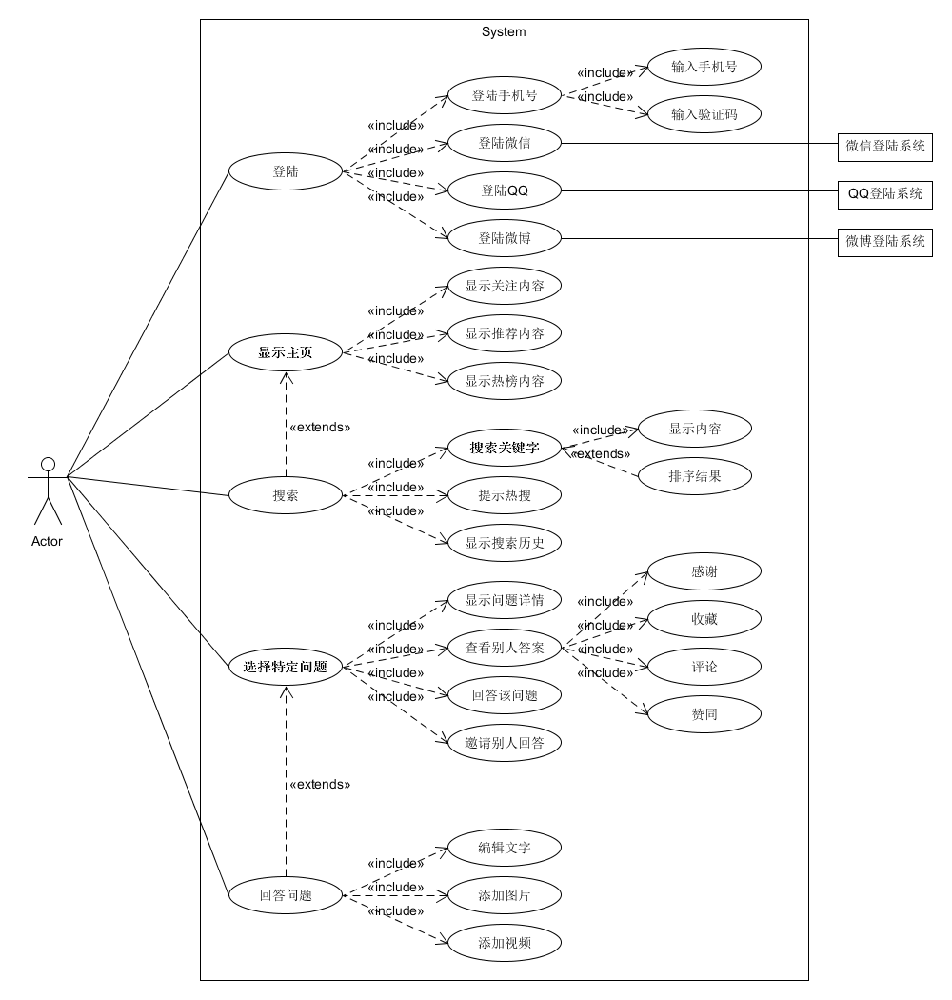
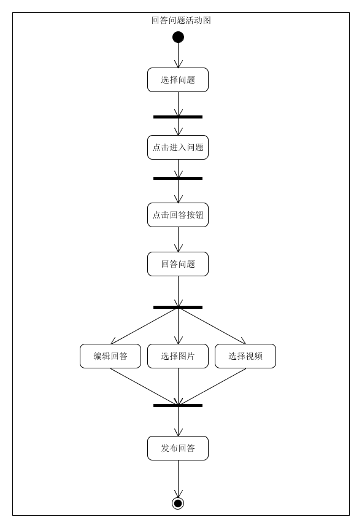
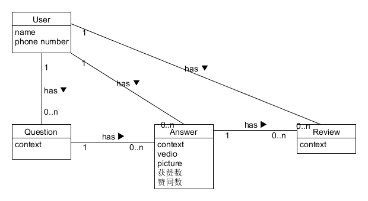
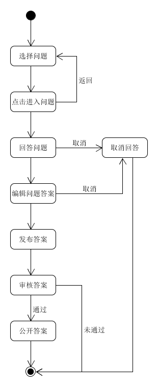
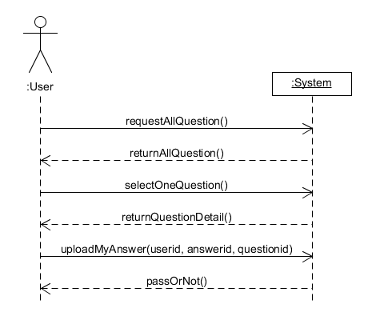

# 建模练习

## “知乎”APP建模练习

学号：15331414

建模任务来自其他小组的[知乎App个人浏览及管理功能业务文档](https://github.com/Movie-ticket-Sale-System/DashBoard/blob/master/doc/%E7%9F%A5%E4%B9%8EApp%E4%B8%AA%E4%BA%BA%E6%B5%8F%E8%A7%88%E5%8F%8A%E7%AE%A1%E7%90%86%E5%8A%9F%E8%83%BD%E4%B8%9A%E5%8A%A1%E6%96%87%E6%A1%A3.md)

**用例图**

**回答问题业务的活动图**

**回答问题领域建模**

**用户对象的状态图**

**回答问题场景的系统顺序图**

**回答问题场景的操作协议**

1. 契约CO1：requestAllQuestion

   操作：requestAllQuestion()

   交叉引用：用例：回答问题

   前置条件：无

   后置条件：

   - 创建了ql实例（创建实例）
   - ql的属性被初始化（修改属性）

2. 契约CO2：returnAllQuestion

   操作：returnAllQuestion()

   交叉引用：用例：回答问题

   前置条件：访问首页

   后置条件：

   - ql的属性被填充（修改属性）

3. 契约CO3：selectOneQuestion

   操作：selectOneQuestion()

   交叉引用：用例：回答问题

   前置条件：无

   后置条件：

   - 创建了q实例（创建实例）
   - q的属性被初始化（修改属性）

4. 契约CO4：returnQuestionDetail

   操作：returnQuestionDetail()

   交叉引用：用例：回答问题

   前置条件：访问指定问题

   后置条件：

   - q的属性被填充（修改属性）

5. 契约CO5：uploadMyAnswer

   操作：uploadMyAnswer(userid, answerid, questionid)

   交叉引用：用例：回答问题

   前置条件：回答问题

   后置条件：

   - 创建了a实例（创建实例）
   - a的属性被初始化（修改属性）
   - a被关联到当前的question（形成关联）

6. 契约CO6：passOrNot

   操作：passOrNot()

   交叉引用：用例：回答问题

   前置条件：回答问题

   后置条件：

   - answer.isPass被置为真（修改属性）

