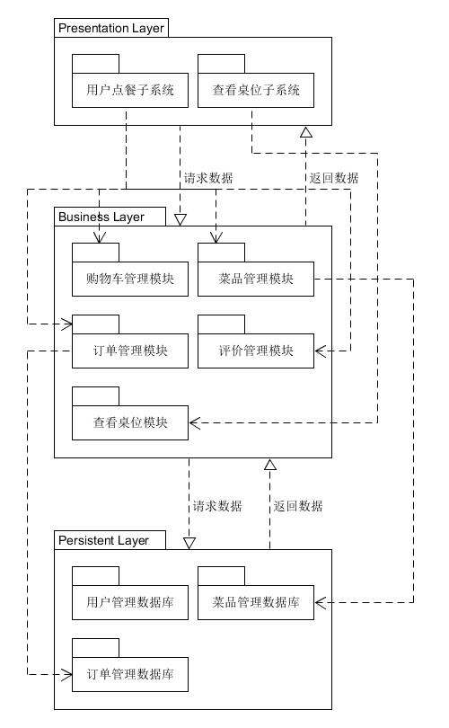

**描述软件架构与框架之间的区别与联系**

**软件架构**就是把系统分解为一些部件，描述这些部件的职责及它们之间的协作行为。 **框架**是特定语言和技术的架构应用解决方案。 其中，他们的**区别**是，软件架构是根据不同的领域区分的，每个架构模式都是特定领域常见问题的解决方案，而框架是根据不同的语言和技术划分的，包含了某项语言和技术在各种业务场景的具体解决方案。他们之间的**联系**是框架是一种或多种架构的组合的实现。

---

**以你的项目为案例**

- 绘制三层架构模型图，细致到分区

  

- 结合你程序的结构，从程序员角度说明三层架构给开发者带来的便利

  ​	采用三层架构使我们在开发过程中只需要关注某一层，这让我们能够明确的分工，开发过程中的架构也更加清晰，并且在开发过程中能够三层架构并行开发，提高开发效率。除此之外，我们能够极大的复用各种模块，比如说每个界面在底部都有一个统计金额的bar，就不需要每个界面单独写一个，只需要一个界面写了这个bar的模块以后，其他界面直接复用即可，并且在更新的时候也很方便，简单的替换旧的模块即可，由于层与层之间的依赖很少，因此在迭代开发中只需要做少量的改动即可。这也使得程序的扩展性和安全性增强，安全性方面，客户端只能通过逻辑层访问数据层，减少了入口点，在逻辑层做好重点的安全保护即可。

  ​	总而言之，三层架构具有低耦合性、高重用性、较低的生命周期成本、快速部署、高可维护性、利于软件工程化管理等特性。 

---

**研究 VUE 与 Flux 状态管理的异同**

**Flux**的状态集管理框架，由facebook创建，专门用来构建前端框架结构的框架，便于维护，用于安全考虑，它分为四层：view视图层、action层、dispatcher派发层、store仓库层。

view action → dispatcher → store return → dispatcher → view（receive method：register()）

**VUEX**是专门为VUE提供的状态管理工具，便于维护，保证安全，VUE中引入VUEX解决状态之间共享的问题。VUEX是多个组件调用一个状态，将原来组建与组件之间的状态传递改成组件与仓库之间的传递。该状态管理工具适用于构建大型的项目，如果不是大型项目，使用VUEX会使代码更加繁琐

**VUEX**核心：

- state：存放多个组件共享的状态（数据）
- mutations：存放更改state里状态的方法，用于变更状态，是唯一一个更改状态的属性
- getters：将state中某个状态进行过滤，然后获取新的状态，类似于vue中的computed
- actions：用于调用事件动作，并传递给mutation
- modules：主要用来拆分state

vueComnent → (dispatch)Action → (commit) → Mutations → (mutate)State → (render)VueComponent

**不同**

1. Flux可以定义多个store，VUEX只能定义一个；
2. VUEX把store和dispatch都放到了store里，结构更加清晰；
3. 在VUEX中本身就内置State对象，对仓库的管理更加明确；
4. VUEX有自动渲染的功能，所以不需要更新 ；

**相同**

1. 都是组件化的状态管理工具
2. 如果把 action 和 mutation 看作一层（Flux里的action），二者结构完全一致 