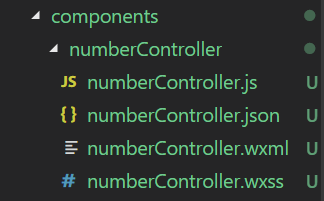
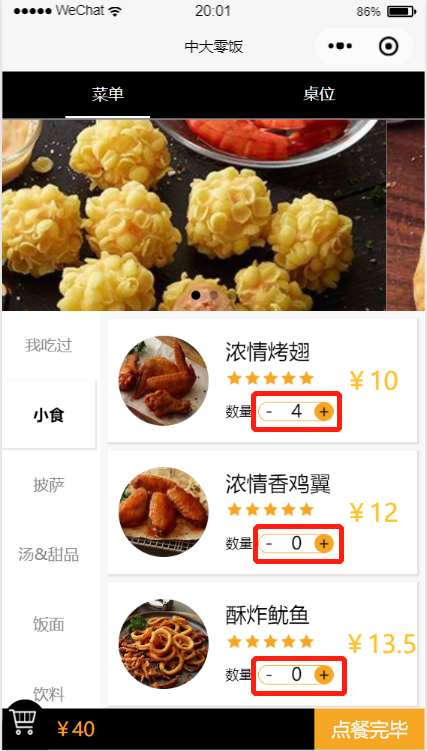

## 简介

​	在微信小程序的开发过程中，发现有的自定义的UI组建需要在多个页面使用到，每个界面都要重新写一次该组件十分麻烦，而且开发起来会感觉代码冗长，可维护性差。因此，在本小程序中使用了自定义组件来减少冗余的代码，也使得程序的可读性和可维护性增强。

​	本文将会讲解如何在微信小程序中使用自定义组件。本次案例的讲解是以常用的**加减器**为例进行讲解的，希望大家能够仔细阅读，以此案例推广到其他的用途上。

---

## 使用步骤

**创建组件**

新建一个`components`文件夹来存放需要被重用的UI组件。

如图所示，创建所需要的文件



案例的需求是点击添加或者减少的按钮，数值会相应的减少。

​	组件初始化工作准备完成，接下来就是组件的相关配置，首先我们需要声明自定义组件，也就是将 `numberController.json` 中 `component` 字段设为 `true` ： 

```json
{
  "component": true,        // 自定义组件声明
  "usingComponents": {}     // 可选项，用于引用别的组件
}
```

​	其次，我们需要在 `numberController.wxml` 文件中编写模版，在 `numberController.wxss` 文件中加入弹窗组件样式，它们的写法与页面的写法一样

`numberController.wxml`

```html
<view class="stepper">
    <!-- 减号 -->
    <view class="stepper-button, disable">
        <text catchtap = "_minusFun">-</text>  
    </view>
    <!-- 数值 -->
    <view class="stepper-num">
        <text>{{amount}}</text>
    </view>
    <!-- 加号 -->
    <view class="stepper-button, normal">
        <text catchtap = "_plusFun">+</text>
    </view>
</view>
```

`numberController.wxss`

```css
/*加减控件*/
.stepper {  
    width: 132rpx;
    height: 32rpx;
    display: flex;
    flex-wrap: row wrap;
    justify-content: space-between;
    border: 1rpx solid rgb(245, 166, 35);
    border-radius: 50rpx;
}  
  
/*加号和减号*/  
.stepper text {
    width: 32rpx;
    height: 32rpx;
    line-height: 30rpx;
    text-align: center;
    vertical-align: middle;
    float: left;
    font-size: 32rpx;
    margin-left: 2rpx;
}

/*数值*/  
.stepper-num {  
    width: auto;
}  

.stepper-button {
    border: 0 solid rgb(245, 166, 35);
    border-radius: 50rpx;
}

/*普通样式*/  
.stepper .normal{  
    color: black;
    background: rgb(245, 166, 35);
}

/*禁用样式*/  
.stepper .disabled{  
    color: #888888;  
}
```

​	在该组件中有两个按钮，分别是**加号**和**减号**，绑定了两个点击事件`_minusFun`和`_plusFun`，同时按钮显示的数字是`amount`值，这些函数和值都将在下面的js文件中定义。`Component` 构造器时可以用来指定自定义组件的属性、数据、方法等，具体的细节可以参考官方文档

``numberController.js`

```javascript
// components/numberController/numberController.js

Component({
    options: {
        multipleSlots: true // 在组件定义时的选项中启用多slot支持
    },
    /**
     * 组件的属性列表
     * 用于组件自定义设置
     */
    properties: {
        amount: {
            type: Number,
            value: 1
        }
    },

    /**
     * 私有数据,组件的初始数据
     * 可用于模版渲染
     */
    data: {
    },

    /**
     * 组件的方法列表
     * 更新属性和数据的方法与更新页面数据的方法类似
     */
    methods: {
        _minusFun() {
            let amount = this.data.amount
            if (amount > 0) {
                amount -= 1
                this.triggerEvent('minus', { amount: amount })
            }
        },

        _plusFun() {
            let amount = this.data.amount
            amount += 1
            this.triggerEvent('plus', { amount: amount })
        }
    }
})
```

**使用组件**

组件编写完之后，就可以在引用了，并且给它设定自定义事件。在使用组件之前，需要先在使用页面的.json文件中进行引用。

`myPage.json`

```json
"usingComponents": {
    "numberController": "../../components/numberController/numberController"
}
```

然后我们在 `myPage.wxml` 中引入它，并增加我们自定义的一些值，如下 

 `myPage.wxml`

```html
<view class='order-num'>
    <text class='food-num'>数量</text>
    <numberController
                      bind:minus="dishAmountChange"
                      bind:plus="dishAmountChange"
                      amount="{{amount}}"/>
</view>
```

在添加绑定事件使用的是`bind:minus`的形式，这里的`minus`就是你在定义组件时通过`triggerEvent`传递过来的事件名。 

`myPage.js`

```javascript
Page({
    data: {
        amount: 0,
    },
    
    dishAmountChange(e) {
        // 获得从组件中传过来的amount的值
        var amount = e.detail.amount
        this.setData({
            amount: amount
        })
    },
})
```

在控制台中可以看到`e.detail`中有一个`amount`属性，该属性就是从组件中传过来的。

## 效果

最终的效果我就直接上图了！

