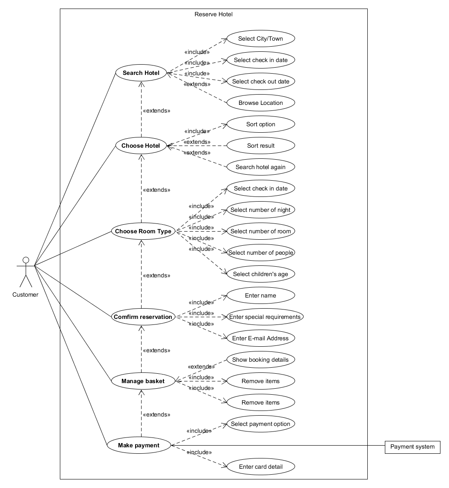
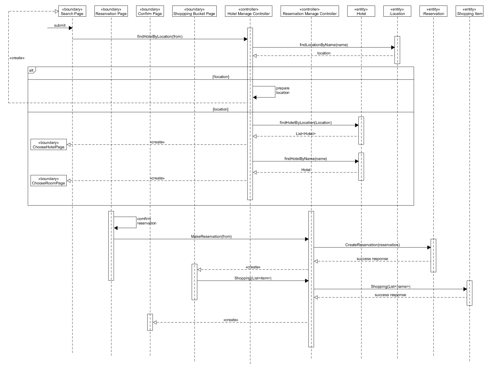
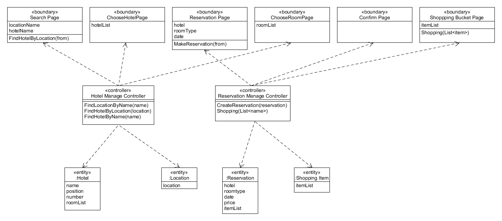
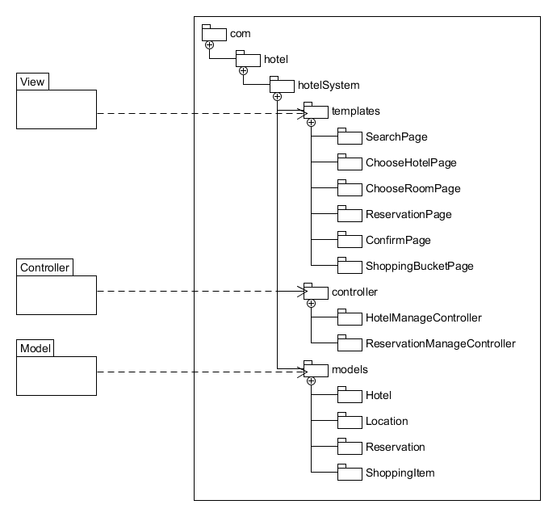

**使用 ECB 实现 make reservation 用例的详细设计（包含用例简介，顺序图，类图）**

---

**用例简介**

用例：make reservation 搜索酒店，选择酒店，选择房间类别，确认预订，管理购物车，支付

**识别类**

| Boundary         | Controller       | Entity   |
| ---------------- | ---------------- | -------- |
| 酒店搜索界面     | 后台酒店管理服务 | 酒店信息 |
| 酒店房间预定界面 | 后台订单管理系统 | 预定订单 |
| 确认订单界面     |                  | 地点     |
| 购物车界面       |                  |          |

**顺序图**

**类图**

**树状图**

